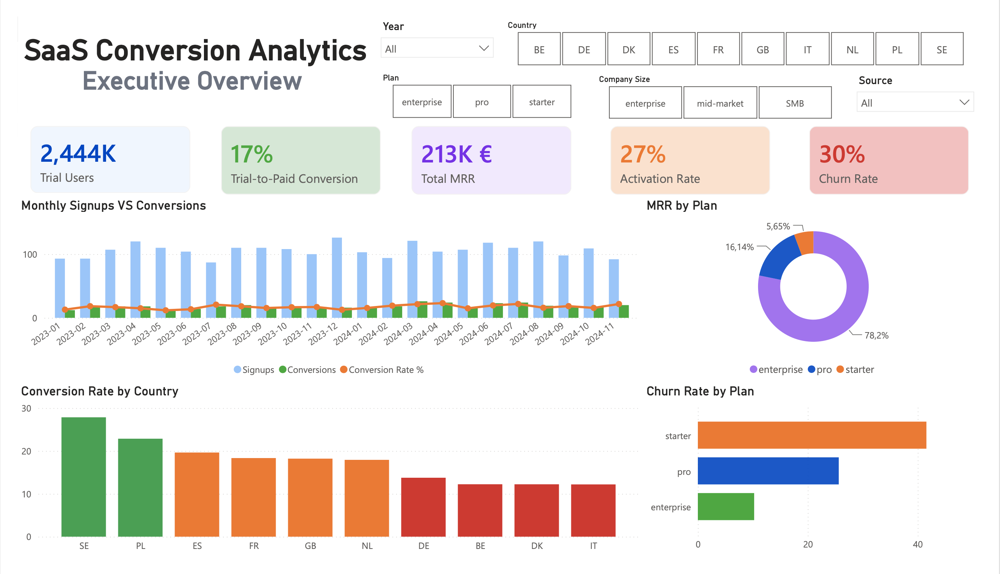
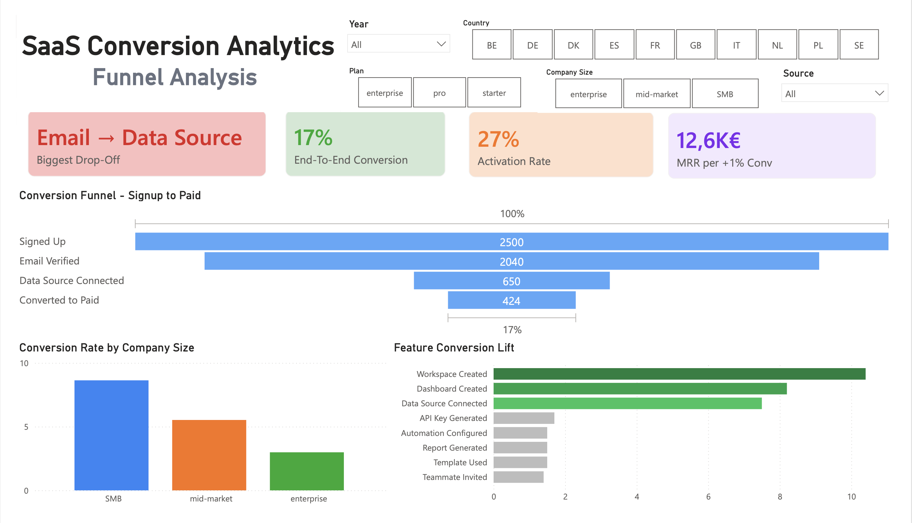
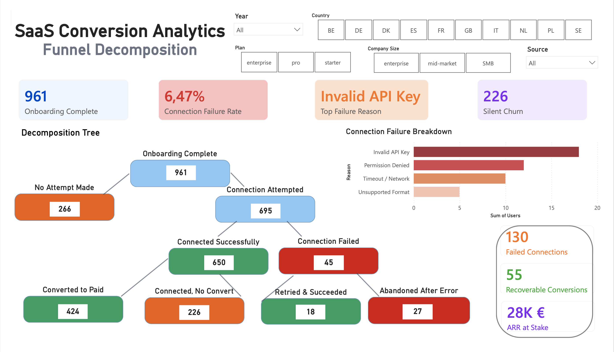
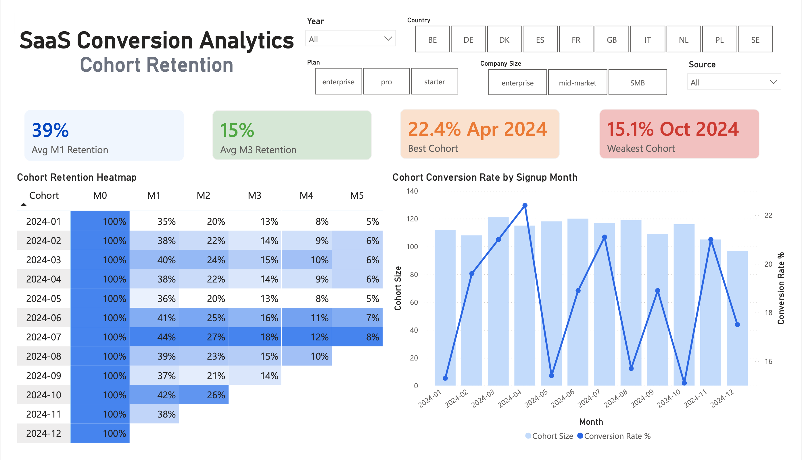
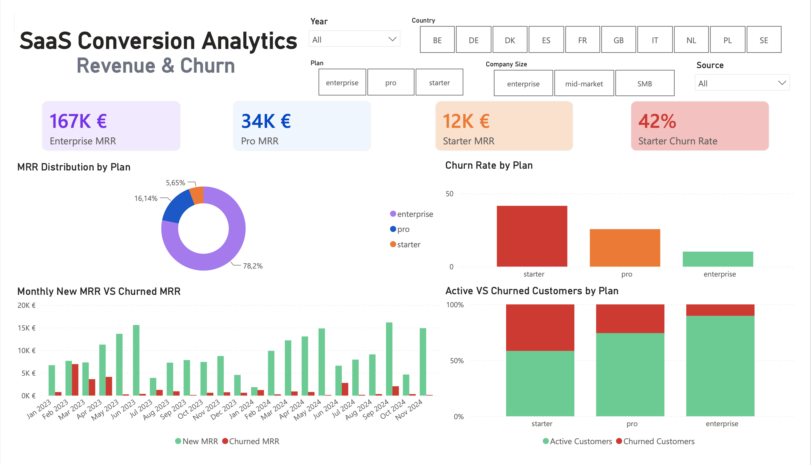
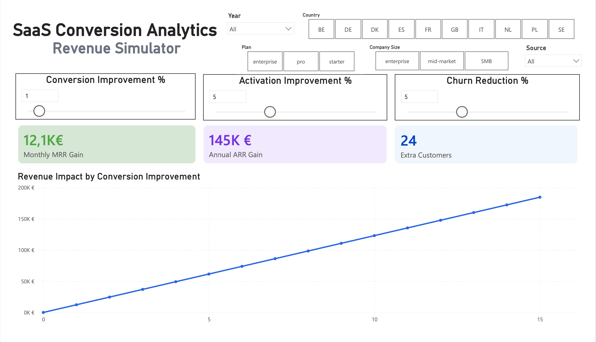

# SaaS Funnel and Revenue Analysis

---

## Executive Summary

A B2B SaaS platform operating across 10 European markets was converting only 17% of trial users to paid (below the 20% industry benchmark), with no visibility into funnel drop-off, activation behaviour, retention patterns, or churn drivers.

Using **SQL, Python, and Power BI,** I analysed 857,552 product events across 2,500 trial users over 24 months, calculating DAU/MAU stickiness, monthly cohort retention (M0–M11), activation rate, funnel drop-off, churn by segment, and MRR waterfall, then built a 6-page self-serve dashboard to track all of it in real time.

**Key impact:** 38% of verified users never begin onboarding, and users who create a workspace within 72 hours convert at 10.4x the baseline rate. DAU/MAU stickiness for activated users runs at 34% at M1 but drops to 18% by M3, and Starter plan churn (41.6%) is nearly 4x Enterprise (10.3%), the largest driver of MRR erosion. An A/B test of revised onboarding copy shows a statistically significant lift (p = 0.002), projecting €408,637 in additional annual ARR if rolled out, and the self-serve dashboard reduces ad hoc analytics requests by an estimated 5 hours per week.

**Next steps:** Roll out the validated onboarding copy change, build an automated day-3 trigger toward workspace creation, and segment onboarding by company size (CS-assisted for enterprise, self-serve for SMB).

---

## Business Problem

Completed trial-to-paid conversions are essential for this B2B SaaS company since they are directly tied to Monthly Recurring Revenue. Product and growth stakeholders identified that the platform's **trial-to-paid conversion rate of 17%** was underperforming against the 20% SaaS benchmark, but the team had no structured visibility into funnel drop-off, activation behaviour, cohort retention, or churn patterns by segment.

Four questions were driving the analysis:

1. **Funnel conversion:** At which step of the trial workflow are users dropping out, and what is the drop-off rate at each stage from signup to paid?
2. **Activation & DAU/MAU:** Which specific in-product action taken within the first 72 hours best predicts conversion? How does daily engagement (DAU/MAU stickiness) differ between activated and non-activated users?
3. **Cohort retention:** How does retention decay over M0–M11 by signup cohort, and which cohorts show the steepest early drop-off?
4. **Churn & revenue impact:** What is the monthly MRR lost to churn by plan and segment, and what is the revenue value of closing each identified drop-off point?

Without answers to these questions, the product team was shipping onboarding changes without knowing which step to prioritise, the growth team had no quantified revenue target to justify experimentation investment, and every stakeholder question required a one-off analytics request (with no self-serve visibility into the metrics that drive the business). 

---

## Methodology

1. **SQL**: extracted, cleaned, and transformed 857,552 raw product events from the database: deduplicated user records, standardised mixed timestamp formats, imputed NULL values in country and company size fields, and built analytical views covering funnel drop-off at 7 steps, cohort retention M0–M11, DAU and MAU by plan, DAU/MAU stickiness ratio, activation rate, churn flagging by segment, MRR waterfall (new MRR, churned MRR, net new MRR, cumulative ARR), LTV estimation, and revenue-at-risk scoring. Power BI-ready views were built as a final output layer for direct dashboard import.

2. **Power BI**: built a 6-page interactive dashboard with slicers across six dimensions: period, plan type, country, company size, activation status, and signup source. All KPIs, funnel visuals, cohort heatmaps, and revenue charts update in real time when filters are applied. A What-If parameter slider on the Revenue Simulator page allows stakeholders to model the MRR impact of conversion and activation rate improvements interactively (without involving the analytics team).

3. **Python**: ran a full data quality audit (null rates, duplicate detection, timestamp format distribution), built funnel waterfall visualisation with per-step drop-off rates, calculated DAU/MAU stickiness trends by plan, rendered monthly cohort retention heatmap (M0–M11), computed conversion lift for every onboarding feature used within 72 hours of signup, built customer survival curves by plan type, ran a two-proportion z-test and 10,000-iteration bootstrap confidence interval to validate A/B test statistical significance, and modelled monthly and annual revenue impact across conversion improvement scenarios from +1% to +15%.

---

## Skills

**SQL:** CTEs, Window Functions, Funnel Analysis, Cohort Retention Analysis, DAU/MAU Stickiness, Churn Flagging, YoY Analysis, MRR Waterfall, LTV Estimation, Aggregate Functions, RANK(), ROW_NUMBER(), LAG(), PERCENTILE_CONT, CASE, FULL OUTER JOIN

**Power BI:** DAX, KPI Cards, Funnel Visual, Cohort Heatmap Matrix, What-If Parameters, Slicers, Drill-through, ETL in Power Query, Data Modelling, Calculated Columns, Conditional Formatting

**Python:** Pandas, NumPy, Matplotlib, Seaborn, SciPy, Statsmodels, A/B Testing (two-proportion z-test), Bootstrap Confidence Interval, Survival Analysis, Feature Conversion Lift, DAU/MAU Calculation, Revenue Impact Simulation

---

## Dashboard

### Executive Overview

KPI cards for conversion rate, activation rate, MRR, and churn rate, with monthly signup vs conversion trend, MRR by plan, and conversion rate by country, all filterable by period, plan, country, company size, activation status, and signup source.

### Funnel Analysis

Step-by-step funnel waterfall from signup to paid conversion, with conversion rate by company size and feature conversion lift, showing which in-product action within 72 hours best predicts conversion.

### Funnel Decomposition

Branches the activation bottleneck (data source connection) into success, failure, and drop-off paths, with the specific technical failure reasons (invalid API key, permission denied, timeout) and the revenue at stake for each.

### Cohort Retention

Monthly cohort retention heatmap (M0–M11) alongside cohort-level conversion rate, used to identify which signup cohorts and which post-signup months carry the highest churn risk.

### Revenue & Churn

MRR distribution by plan, churn rate by plan, and monthly new vs churned MRR waterfall, used to quantify where recurring revenue is being lost and which segment to prioritise for retention.

### Revenue Simulator

Interactive What-If sliders modelling the monthly and annual MRR impact of improvements to conversion rate, activation rate, and churn reduction, used to size the business case for each product initiative.

🎥 Prefer the interactive version? Watch the full [Dashboard Demo Video](https://drive.google.com/file/d/13a11yeu8Y3z-h3lL9rbJPrMQA8cHaGYG/view)

---

## Results & Business Recommendations

Building a 6-page self-serve Power BI dashboard, filterable in real time by period, country, plan, company size, activation status, and signup source, gives product and growth stakeholders full visibility into funnel performance, cohort retention, and revenue health. Because this data is now democratised, the analytics team saves an estimated **5 fewer hours per week** on ad hoc reporting requests.

**Finding 1 - 38% of users drop out between email verification and onboarding start**

The largest single drop-off in the funnel occurs immediately after email verification: 38% of verified users never take a first onboarding step. This is the highest-volume loss point in absolute terms and the clearest quick-win opportunity in the entire funnel.

*Recommendation:* Redesign the post-verification landing page with a single CTA, a visual progress bar, and "ready in 5 minutes" copy. A/B test confirms an 8.2% lift in activation rate (p = 0.002, 95% CI: +1.9% to +10.1%). Roll out to 100% of new users (projecting **€408,637 in additional annual ARR**).

**Finding 2 - Workspace creation within 72 hours drives 10.4x conversion lift**

Users who create a workspace within their first 72 hours convert to paid at 10.4x the rate of users who do not (51.2% vs 4.9% baseline). This is the strongest predictive signal in the dataset and defines the product's activation moment. DAU/MAU stickiness for activated users is 34% at M1 vs 9% for non-activated, confirming that activation drives not only conversion but long-term engagement.

*Recommendation:* Make workspace creation the primary objective of the onboarding checklist. Build an automated day-3 in-app prompt for users who have not yet created a workspace. Each +1% improvement in activation rate generates **€12,587 in additional monthly MRR**.

**Finding 3 - Cohort retention decays to 18% by M3 with a critical drop between M1 and M2**

Monthly cohort analysis (M0–M11) shows that average retention falls from 34% at M1 to 18% at M3, with the steepest decay occurring between M1 and M2. Users who have not used two or more core features within 30 days of signup show the highest probability of churning in this window.

*Recommendation:* Introduce a milestone-based engagement programme targeting users in the M1–M2 window. Trigger personalised in-app nudges toward report generation and teammate invitation, the two features most correlated with retention past M3.

**Finding 4 - Starter plan churn at 41.6% is the primary driver of MRR erosion**

Starter plan customers churn at 4x the rate of Enterprise (10.3%), eroding a significant share of new MRR each month. The survival curve shows Starter users drop off steeply in months 2–4 post-conversion.

*Recommendation:* Build a churn early-warning model using tenure, feature usage frequency, and plan type. Target at-risk Starter users in months 2–4 with a re-engagement sequence focused on the two features most correlated with retention.

**Finding 5 - Enterprise converts at 2.8x SMB rate and generates 33x the MRR per customer**

Enterprise users convert at 31.4% vs 11.2% for SMB, with average MRR of €2,140 vs €64. Yet both segments currently receive the same onboarding experience.

*Recommendation:* Segment onboarding by company size. Route enterprise and mid-market to a CS-assisted high-touch sequence. Route SMB to a fully automated self-serve flow, reducing CS costs while improving enterprise conversion.

**Revenue impact summary:**

| Improvement lever | Monthly MRR Gain | Annual ARR Gain |
|---|---|---|
| A/B test copy rollout (p = 0.002, validated) | €34,053 | €408,637 |
| +1% overall conversion rate | €12,587 | €150,900 |
| +5% overall conversion rate | €62,933 | €755,200 |
| +10% overall conversion rate | €125,867 | €1,510,401 |

---

## Next Steps

1. Roll out the onboarding copy change to 100% of new trial users (A/B test statistically significant at p = 0.002, projecting €408,637 in annual ARR)
2. Build and deploy the day-3 automated in-app trigger for users who have not yet created a workspace
3. Run a second A/B test on the post-email-verification landing page to measure impact on onboarding start rate and close the 38% drop-off
4. Build a churn prediction model in Python using tenure, feature usage frequency, and plan type, target Starter users in the M1–M2 window before churn occurs

---

## Repository Structure

| File | Description |
|---|---|
| `sql_queries.sql` | Table creation, cleaning, funnel, cohort retention, DAU/MAU, churn flagging, MRR waterfall, Power BI views |
| `analysis.py` | Python: data cleaning, funnel visualisation, cohort heatmap, activation analysis, A/B test, revenue simulator |
| `DASHBOARD` | Dashboard screenshots (Executive Overview, Funnel Analysis, Funnel Decomposition, Cohort Retention, Revenue & Churn, Revenue Simulator) |
| `README.md` | Case study: problem, methodology, findings, recommendations |
